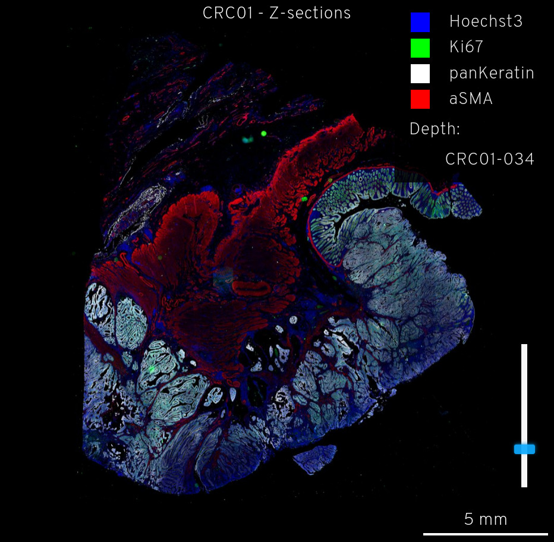

# UnMICST - Universal Models for Identifying Cells and Segmenting Tissue  
  

 
  (pronounced un-mixed)

## Introduction
Nuclei segmentation, especially for tissues, is a challenging and unsolved problem. Convolutional neural networks are particularly well-suited for this task: separating the foreground class (nuclei pixels) from the background class. UnMICST generates probability maps where the intensity at each pixel defines how confident the pixel has been correctly classified to the aforementioned classes. These maps can make downstream image binarization more accurate using tools such as s3segmenter. https://github.com/HMS-IDAC/S3segmenter. UnMICST currently uses the UNet architecture (Ronneberger et al., 2015) but Mask R-CNN and Pyramid Scene Parsing (PSP)Net are coming very soon! **The concept, models, and training data are featured here: https://www.biorxiv.org/content/10.1101/2021.04.02.438285v1 **

## Contents
* [Data Overviews](#data-overviews)
* [About Minerva](#about-minerva)

## Data Explorations

<figure class="figure-story">
  <a href="{{ site.baseurl }}">
    
    <figcaption>CRC01 introduction</figcaption>
  </a>
</figure>

{::comment}
[CRC01 Z-stack   {:width="400px" height="391px"}]({{ site.baseurl }})
{:/comment}

## About Minerva
### Exploring the primary image data in Lin-Wang-Sorger et al.

Yapp et al. (2021) contains a TMA core image that is over 1 GB. As part of the review process for this manuscript, we provide access to this data in the form of a Minerva story, a convenient and open source Minerva software designed for the [Human Tumor Atlas Network
(HTAN)](https://humantumoratlas.org/) by the Laboratory of Systems Pharmacology.

Minerva enables intuitive real-time exploration of very large (gigapixel)
high-plex images in the cloud using a web browser. With Minerva, users can pan
around and magnify areas of an image and switch between channels. Minerva does
not require the installation of any software and is therefore secure; browsing
is also anonymous. Users interested in the tool are welcome to explore the
[documentation](https://github.com/labsyspharm/minerva-story/wiki), the
[software publication](https://joss.theoj.org/papers/10.21105/joss.02579), and a
description of [digital
docents](https://www.biorxiv.org/content/10.1101/2020.03.27.001834v2) in
general.

We provide a Minerva story with this paper to provide access to minimally processed Level 2 images with annotation and interpretation kept to a bare minimum.

## Downloading training data and models
https://www.dropbox.com/sh/3aqp83f5w1pxk0y/AABFgNRMJD2EvfSLFgCrXrBba?dl=0

